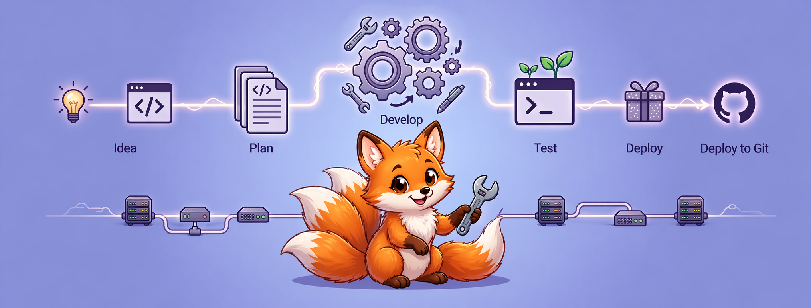

# FastForward\DevTools

FastForward DevTools is a Composer plugin that standardizes quality checks,
documentation builds, consumer repository bootstrap, and packaged agent skills
across Fast Forward libraries.

[](https://www.php.net/releases/)
[](https://packagist.org/packages/fast-forward/dev-tools)
[](https://github.com/php-fast-forward/dev-tools/actions/workflows/tests.yml)
[](https://php-fast-forward.github.io/dev-tools/coverage/index.html)
[](https://php-fast-forward.github.io/dev-tools/metrics/index.html)
[](https://php-fast-forward.github.io/dev-tools/index.html)
[](LICENSE)
[](https://github.com/sponsors/php-fast-forward)

<p align="center">
  
</p>

## ✨ Features

- Aggregates refactoring, PHPDoc, code style, tests, and reporting under a
  single Composer-facing command vocabulary
- Adds dependency analysis for missing and unused Composer packages through a
  single report entrypoint
- Manages Keep a Changelog 1.1.0 files with local authoring, validation,
  version inference, release promotion, and release-note rendering commands
- Ships shared workflow stubs, `.editorconfig`, Dependabot configuration, and
  other onboarding defaults for consumer repositories
- Packages a rigorous pull-request review skill, matching `review-guardian`
  project agent, and ready-for-review workflow brief for high-signal review
  intake
- Generates `.github/CODEOWNERS` files from local project metadata instead of
  shipping repository-specific owners into consumers
- Synchronizes packaged skills and project-agent prompts into consumer
  `.agents/skills` and `.agents/agents` directories using safe link-based
  updates
- Works both as a Composer plugin and as a local binary
- Preserves local overrides through consumer-first configuration resolution

## 🚀 Installation

```bash
composer require --dev fast-forward/dev-tools
```

## 🛠️ Usage

Once installed, the plugin automatically exposes the aggregated `dev-tools`
command and the individual Composer commands described below.

```bash
# Run all standard checks (refactoring, code styling, docs, tests, and reports)
composer dev-tools

# Automatically fix code standards issues where applicable
composer dev-tools:fix
```

You can also run individual commands for specific development tasks:

```bash
# Run PHPUnit tests
composer dev-tools tests

# Analyze missing, unused, misplaced, and outdated Composer dependencies
composer dependencies
composer dependencies --max-outdated=8
composer dependencies --max-outdated=-1
composer dependencies --dev
composer dependencies --dump-usage=symfony/console
composer dependencies --upgrade --dev

# Analyze code metrics with PhpMetrics
composer metrics
composer metrics --target=.dev-tools/metrics
composer --working-dir=packages/example metrics

# Add one changelog entry to Unreleased or a published version
composer changelog:entry "Add changelog automation for release workflows (#28)"
composer changelog:entry --type=fixed --release=1.2.0 --date=2026-04-19 "Preserve published release sections during backfill (#28)"
composer changelog:entry --json "Add changelog automation for release workflows (#28)"
composer changelog:entry --pretty-json "Add changelog automation for release workflows (#28)"

# Verify that the current branch added a meaningful Unreleased entry
composer changelog:check
composer changelog:check --against=origin/main
composer changelog:check --json
composer changelog:check --pretty-json

# Infer the next semantic version from Unreleased
composer changelog:next-version
composer changelog:next-version --json

# Promote Unreleased into a published version
composer changelog:promote 1.3.0
composer changelog:promote 1.3.0 --json

# Render one published section as release notes
composer changelog:show 1.3.0
composer changelog:show 1.3.0 --json

# Check and fix code style using ECS and Composer Normalize
composer code-style

# Refactor code using Rector
composer refactor

# Check and fix PHPDoc comments
composer phpdoc

# Generate HTML API documentation using phpDocumentor
composer docs

# Generate Markdown documentation for the wiki
composer wiki

# Generate documentation frontpage and related reports
composer reports
composer reports --target=.dev-tools --coverage=.dev-tools/coverage

# Synchronize packaged agent skills into .agents/skills
composer skills

# Synchronize packaged project agents into .agents/agents
composer agents

# Synchronize Composer funding metadata with .github/FUNDING.yml
composer funding
composer funding --dry-run

# Generate .github/CODEOWNERS from composer.json metadata
composer codeowners
composer codeowners --interactive

# Merges and synchronizes .gitignore files
composer gitignore

# Manages .gitattributes export-ignore rules for leaner package archives
composer gitattributes

# Generates a LICENSE file from composer.json license information
composer license

# Copies packaged or local resources into the consumer repository
composer copy-resource --source resources/docblock --target .docheader

# Installs Fast Forward Git hooks
composer git-hooks

# Updates the composer.json file to match the packaged schema
composer update-composer-json --force

# Installs and synchronizes dev-tools scripts, GitHub Actions workflows,
# .editorconfig, .gitignore rules, packaged skills, packaged agents, and the
# repository wiki submodule in .github/wiki
composer dev-tools:sync
```

The `dependencies` command ships with
`shipmonk/composer-dependency-analyser` and `rector/jack` as direct
dependencies of `fast-forward/dev-tools`, so it works without extra
installation in the consumer project.

The packaged `tests.yml` workflow runs dependency health as a required job and
defaults to `--max-outdated=-1`, which keeps outdated-package findings visible
in CI without failing the workflow for their count alone.

The `metrics` command ships with `phpmetrics/phpmetrics` as a direct
dependency of `fast-forward/dev-tools`, so consumer repositories can generate
metrics reports without extra setup.

The changelog commands manage Keep a Changelog 1.1.0 files without requiring
extra tooling in the consumer repository. `changelog:entry` bootstraps a
missing changelog file on first use, `changelog:check` enforces meaningful
`Unreleased` entries in pull requests, `changelog:next-version` infers the
next semantic version from pending changes, `changelog:promote` publishes the
current `Unreleased` section into a tagged version, and `changelog:show`
renders one published section for GitHub release notes.

Structured output is available across the DevTools command surface through
`--json`, which returns deterministic `message` / `level` / `context` payloads
for CI, bots, and AI-agent workflows while preserving the normal
human-readable terminal output by default. Use `--pretty-json` when you want
the same structured payload indented for manual inspection in a terminal.
`--pretty-json` also implies JSON output, so there is no need to pass both
flags together. In agent environments, DevTools can also switch to JSON
automatically when the runtime is detected as agent-driven. For
`changelog:next-version` and `changelog:show`, the default text mode still
prints raw values so release workflows can keep capturing semantic versions
and piping rendered release notes directly into GitHub releases.

Progress output is disabled by default on the commands that support transient
rendering, and `--progress` re-enables it for human-readable terminal runs.
When `--json` or `--pretty-json` is active on commands that orchestrate other
tools, DevTools keeps progress suppressed, forwards JSON flags where the
underlying tool supports structured output, and otherwise falls back to
quieter subprocess modes so the captured payload stays machine-readable. In
GitHub Actions, queued subprocess output is grouped into collapsible sections,
and logged failures emit native workflow error annotations, including file and
line metadata when commands provide it. The packaged tests, reports, wiki, and
changelog workflows also append concise Markdown outcomes to
`GITHUB_STEP_SUMMARY` so maintainers can scan versions, URLs, preview refs,
verification status, and release results without expanding full logs. This
repository also keeps a bounded retry workflow that reruns failed jobs once
when failed job logs match transient GitHub-side checkout or transport errors
such as HTTP 500 fetch failures, while leaving genuine logic and quality
failures untouched.

When the packaged changelog workflow is synchronized into a consumer
repository, pull requests are expected to add a notable changelog entry before
merge. The same workflow can be triggered manually to prepare a release bump
pull request from `Unreleased`, and merged release branches publish GitHub
releases from the exact changelog section body.

The `funding` command keeps supported `composer.json` funding entries aligned
with `.github/FUNDING.yml`, including GitHub Sponsors handles and `custom`
URLs, while preserving unsupported providers in place and re-running
`composer normalize` after manifest updates.

The `codeowners` command generates `.github/CODEOWNERS` from local
`composer.json` metadata. It prefers explicit GitHub profile URLs from author
metadata, falls back to commented suggestions from support metadata, and can
prompt for owners when `--interactive` is used in a terminal.

The `skills` command keeps `.agents/skills` aligned with the packaged Fast
Forward skill set. It creates missing links, repairs broken links, and
preserves existing non-symlink directories. The `dev-tools:sync` command calls
`skills` automatically after refreshing the rest of the consumer-facing
automation assets. The packaged skills include reusable flows for GitHub issue
authoring, issue implementation, changelog maintenance, and rigorous pull
request review.

The `agents` command keeps `.agents/agents` aligned with the packaged Fast
Forward project-agent prompt set. It follows the same symlink-preservation and
broken-link-repair safety model as the packaged skill synchronization flow, and
`dev-tools:sync` calls it automatically in normal synchronization mode. The
packaged agent set includes role prompts such as `issue-implementer`,
`docs-writer`, `test-guardian`, `readme-maintainer`, `review-guardian`, and
`changelog-maintainer`.

The packaged workflow stubs synchronized by `dev-tools:sync` now also include
changelog automation for pull-request validation and release preparation, so
consumer repositories can adopt the same changelog-driven release flow without
copying workflow logic by hand. They also include a rigorous review intake
workflow that reacts when a pull request becomes ready for review and posts a
deterministic brief for the dedicated review agent.

The release workflow is intentionally two-step: `workflow_dispatch` prepares a
`release/v...` pull request, and merging that release pull request publishes
the GitHub release and tag. Consumer repositories must enable GitHub Actions
**Read and write permissions** and **Allow GitHub Actions to create and approve
pull requests** under `Settings -> Actions -> General`. If those controls are
disabled, an organization or repository admin must unlock them before the
release-preparation workflow can create pull requests.

This repository also keeps role-based project agents in `.agents/agents`. They
are packaged for consumer repositories alongside `.agents/skills`, so
downstream projects can adopt both reusable role prompts and the procedural
skills they depend on.

## 🧰 Command Summary

| Command | Purpose |
|---------|---------|
| `composer dev-tools` | Runs the full `standards` pipeline. |
| `composer tests` | Runs PHPUnit with local-or-packaged configuration. |
| `composer dependencies` | Previews Jack dependency updates, then reports missing, unused, misplaced, and outdated Composer dependencies. |
| `composer metrics` | Runs PhpMetrics for the current project and generates requested report artifacts. |
| `composer changelog:entry` | Adds one categorized changelog entry to `Unreleased` or a published release section. |
| `composer changelog:check` | Verifies that a changelog file contains meaningful `Unreleased` notes, optionally against a git base reference. |
| `composer changelog:next-version` | Infers the next semantic version from the current changelog state. |
| `composer changelog:promote` | Moves `Unreleased` entries into a published version section and records the release date. |
| `composer changelog:show` | Renders one published changelog section for release notes and automation. |
| `composer docs` | Builds the HTML documentation site from PSR-4 code and `docs/`. |
| `composer agents` | Creates or repairs packaged project-agent links in `.agents/agents`. |
| `composer skills` | Creates or repairs packaged skill links in `.agents/skills`. |
| `composer funding` | Synchronizes managed funding metadata between `composer.json` and `.github/FUNDING.yml`. |
| `composer codeowners` | Generates managed `.github/CODEOWNERS` content from local repository metadata. |
| `composer gitattributes` | Manages export-ignore rules in `.gitattributes`. |
| `composer dev-tools:sync` | Updates scripts, CODEOWNERS, funding metadata, workflow stubs, `.editorconfig`, `.gitignore`, `.gitattributes`, wiki setup, packaged skills, and packaged agents. |

## 🔌 Integration

DevTools integrates with consumer repositories in two ways. The Composer plugin
exposes the command set automatically after installation, and the local binary
keeps the same command vocabulary when you prefer running tools directly from
`vendor/bin/dev-tools`. The consumer sync flow also refreshes `.agents/skills`
and `.agents/agents` so agents can discover the packaged skills and packaged
role prompts shipped with this repository, including workflows for GitHub
issue/PR handling, changelog maintenance, rigorous pull-request review, PHP
quality tasks, Sphinx docs, README generation, and repository `AGENTS.md`
authoring.

## 🏗️ Architecture

- `Composer Plugin` - `FastForward\DevTools\Composer\Plugin` exposes the
  packaged command set to Composer and runs `dev-tools:sync` after install and
  update.
- `DevTools Container` - `FastForward\DevTools\Console\DevTools::create()`
  builds a shared container from `DevToolsServiceProvider`, which wires
  process execution, filesystem access, changelog services, Git helpers,
  diffing, reporting, and template loading.
- `Generic Link Synchronization` -
  `FastForward\DevTools\Sync\PackagedDirectorySynchronizer` provides the
  shared symlink-preserving workflow used by both `skills` and `agents`,
  keeping consumer-owned directories intact while repairing broken links.
- `Lazy Command Loading` - `DevToolsCommandLoader` discovers `#[AsCommand]`
  classes and resolves most commands only when they are invoked, while
  orchestration commands such as `standards` dispatch other commands through
  the console application itself.
- `Consumer Sync Pipeline` - `dev-tools:sync` refreshes `composer.json`,
  CODEOWNERS, funding metadata, workflow stubs, repository defaults, git
  metadata files, packaged Git hooks, and, in normal mode, the wiki submodule
  plus packaged skills and packaged project agents.

## 🤝 Contributing

Run `composer dev-tools` before opening a pull request. If you change public
commands or consumer onboarding behavior, update `README.md` and `docs/`
together so downstream libraries keep accurate guidance.

Notable pull requests are also expected to add a changelog entry before
review is complete. A typical contributor flow looks like this:

```bash
# Record the user-visible change
composer changelog:entry --type=changed "Refine changelog automation for release publication (#28)"

# Validate that the branch added meaningful Unreleased notes
composer changelog:check --against=origin/main
```

For release preparation, maintainers can infer and promote the next version
locally before using the packaged GitHub workflow:

```bash
# Inspect the version that Unreleased implies
composer changelog:next-version

# Publish Unreleased into the selected version and review the resulting notes
composer changelog:promote 1.3.0
composer changelog:show 1.3.0
```

## 📄 License

This package is licensed under the MIT License. See the [LICENSE](LICENSE) file for more details.

## 🔗 Links

- [Repository](https://github.com/php-fast-forward/dev-tools)
- [Packagist](https://packagist.org/packages/fast-forward/dev-tools)
- [Documentation](https://php-fast-forward.github.io/dev-tools/index.html)
- [RFC 2119](https://datatracker.ietf.org/doc/html/rfc2119)
